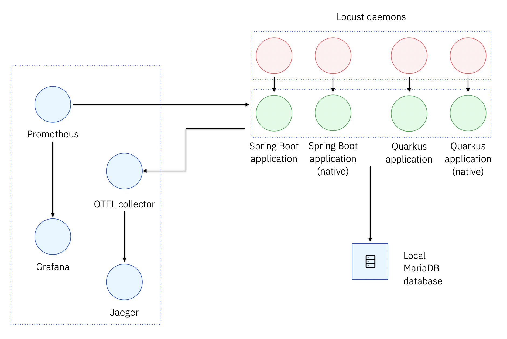

# Quarkus optimization PoC

## Introduction

This small PoC attempts to roughly measure the magnitude of the savings one can achieve by switching to technologies
that are tailored for containerized deployments, in the context of Java applications.

The measure is estimated by comparing the consumption of resources (CPU and RAM) between a baseline application and a "modernized" application.

## The baseline application

A simple Spring Boot 3 application is used as a baseline, configured in order to expose Prometheus application metrics and a `GET /dummies` operation.
Of course, picturing Spring Boot 3 as an obsolete technology is absolutely wrong, and that's not the objective of this small experiment.
The baseline application is simply not _specialized_ for running as a container.

## Optimizations

This experiment tests the effect of two layers of optimization on baseline application: building it as a native Java application, and rewriting it using Quarkus.
As a result, there are four different test subjects:

1. the baseline application (Spring Boot app, [traditional build](./sample-spring-boot-be/src/main/docker/Dockerfile.jvm))
2. the baseline application, built natively (Spring Boot app, [native build](./sample-spring-boot-be/src/main/docker/Dockerfile.native))
3. the application rewritten in Quarkus (Quarkus app, [traditional build](./sample-quarkus-be/src/main/docker/Dockerfile.jvm))
4. the application rewritten in Quarkus, built natively (Quarkus app, [native build](./sample-quarkus-be/src/main/docker/Dockerfile.native))

The four applications are run in a [`docker-compose` environment](./quarkus-optimization-poc-compose/docker-compose.yaml);
this allows to easily spin up the whole structure needed for the experiment.

## The Quarkus-optimized application

As stated above, one of the optimizations tested on the baseline application is to rewrite it using Quarkus instead of Spring Boot.
In order for the comparison to make any sense, the Quarkus application was developed as similar as possible to the baseline: same patterns, same features, etc.

## The test environment

The following diagram represents the test environment.



Specifically, the test environment consists of the following components:

- a MariaDB database, serving as the data layer of all four applications;
- the four test applications; all applications are functionally the same: they all expose a `GET /dummies` operation; they all fetch some data from the `DUMMY` table on the database and relay it to the client when the operation is invoked; they all expose their metrics in pretty much the same way
- a small observability stack, most notably a Prometheus instance scraping our application metrics, and a Grafana instance allowing to process and visualize them
- a set of Locust daemons, simulating traffic directed to the applications

## Running the experiment

Reproducing the experiment _should_ be as easy as running

```bash
docker-compose up
```

within the [quarkus-optimization-poc-compose](./quarkus-optimization-poc-compose) directory.

That will attempt to build all four test applications concurrently, which might result in issues. If the builds fail,
execute them one by one, and _then_ run `docker-compose up`:

```bash
docker-compose build sample-spring-be && \
docker-compose build sample-quarkus-be && \
docker-compose build sample-spring-native-be && \
docker-compose build sample-quarkus-native-be && \
docker-compose up
```